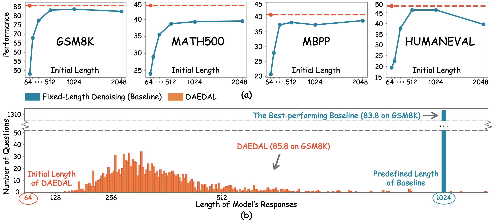
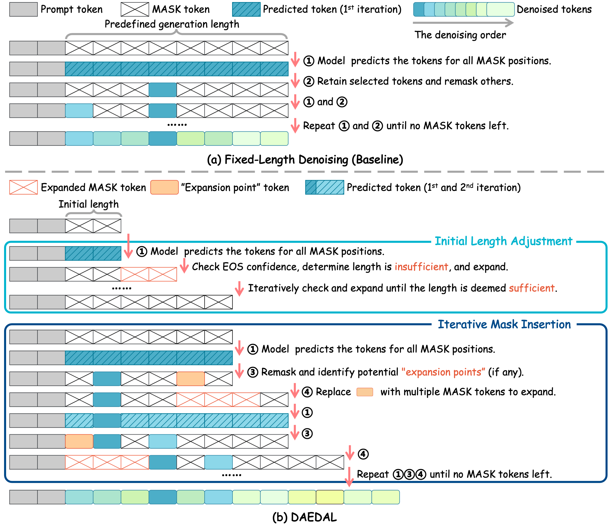

<div align="center">

<p align="center">
  
</p>

<h1>Beyond Fixed: Variable-Length Denoising for Diffusion Large Language Models</h1>

<div>
    <a href="https://li-jinsong.github.io/" target="_blank">Jinsong Li</a><sup>1,2</sup> | 
    <a href="https://lightdxy.github.io/" target="_blank">Xiaoyi Dong</a><sup>1,2</sup> | 
    <a href="https://yuhangzang.github.io/" target="_blank">Yuhang Zang</a><sup>2</sup> | 
    <a href="https://scholar.google.com/citations?hl=zh-CN&user=sJkqsqkAAAAJ" target="_blank">Yuhang Cao</a><sup>2</sup> | 
    <a href="https://myownskyw7.github.io/" target="_blank">Jiaqi Wang</a><sup>2</sup> |
    <a href="http://dahua.site/" target="_blank">Dahua Lin</a><sup>1,2</sup>
</div>
<br>
<div>
    <sup></sup><sup>1</sup> The Chinese University of Hong Kong<br><sup>2</sup> Shanghai AI Laboratory
</div>
<br>

[](https://arxiv.org/abs/2508.00819) 

---


<strong>💡 DAEDAL is a training-free denoising strategy that unlocks dynamic and variable-length generation for DLLMs, achieving performance comparable, and sometimes superior, to meticulously tuned fixed-length baselines.</strong>

<details><summary><strong>📖 Click for the full abstract of DAEDAL</strong></summary>

<div align="left">

> Diffusion Large Language Models (DLLMs) are emerging as a powerful alternative to the dominant Autoregressive Large Language Models, offering efficient parallel generation and capable global context modeling. However, the practical application of DLLMs is hindered by a critical architectural constraint: the need for a statically predefined generation length. This static length allocation leads to a problematic trade-off: insufficient lengths cripple performance on complex tasks, while excessive lengths incur significant computational overhead and sometimes result in performance degradation. 
>
> While the inference framework is rigid, we observe that the model itself possesses internal signals that correlate with the optimal response length for a given task. 
> To bridge this gap, we leverage these latent signals and introduce <b>DAEDAL</b>, a novel training-free denoising strategy that enables <b>D</b>ynamic <b>A</b>daptive Length <b>E</b>xpansion for <b>D</b>iffusion L<b>a</b>rge <b>L</b>anguage Models. 
> DAEDAL operates in two phases: 1) Before the denoising process, DAEDAL starts from a short initial length and iteratively expands it to a coarse task-appropriate length, guided by a sequence completion metric. 2) During the denoising process, DAEDAL dynamically intervenes by pinpointing and expanding insufficient generation regions through mask token insertion, ensuring the final output is fully developed.
>
> Extensive experiments on DLLMs demonstrate that DAEDAL achieves performance comparable, and in some cases superior, to meticulously tuned fixed-length baselines, while simultaneously enhancing computational efficiency by achieving a higher effective token ratio. By resolving the static length constraint, DAEDAL unlocks new potential for DLLMs, bridging a critical gap with their Autoregressive counterparts and paving the way for more efficient and capable generation.
</details>
</div>

<br>

<div style="width: 100%; text-align: center; margin:auto;">
    
</div>


## 📢 News
- [2025/08/04] Code are released!
- [2025/08/04] Paper is available on arXiv!


## 💻 Overview
<div style="width: 100%; text-align: center; margin:auto;">
    
</div>
<br>

We introduce DAEDAL, a training-free, two-phase inference strategy designed to listen to these internal signals and empower the DLM with dynamic, variable-length denoising.

1. <strong>Initial Length Adjustment:</strong> Before the main denoising begins, DAEDAL starts with a short, unified length. It performs a quick check: "Based on this prompt, is the currently allocated length sufficient?" It measures this by checking the EOS confidence at the end of the sequence. If the confidence is low, the model is signaling the budget is insufficient. DAEDAL then expands the length by adding more `[MASK]` tokens and repeats this check until the model is confident the budget is sufficient. This sets a reasonable global length for the task.

2. <strong>Iterative Mask Insertion:</strong> During the step-by-step denoising process, DAEDAL continues to monitor the model's confidence. If it finds a specific `[MASK]` token that the model is extremely uncertain abou, it marks this as an "expansion point". DAEDAL intervenes by replacing that single `[MASK]` with a block of new `[MASK]`s. This dynamically inserts "breathing room" into the sequence exactly where the model needs it to elaborate on a complex thought or bridge a logical gap.

DAEDAL allows the DLM to autonomously decide its own response length on a per-problem basis. By resolving the static length constraint, DAEDAL unlocks new potential for DLLMs, bridging a critical gap with their Autoregressive counterparts and paving the way for more efficient and capable generation.


## 🔧 Setup
### Setup repository and conda environment

```bash
git clone https://github.com/Li-Jinsong/DAEDAL.git
cd DAEDAL

conda create -n daedal python=3.10
conda activate daedal

pip install -r requirements.txt
```

### Prepare the model checkpoints.

LLaDA-8B-Instruct: [GSAI-ML/LLaDA-8B-Instruct](https://huggingface.co/GSAI-ML/LLaDA-8B-Instruct)

LLaDA-1.5: [GSAI-ML/LLaDA-1.5](https://huggingface.co/GSAI-ML/LLaDA-1.5)

Then update the `MODEL_PATH` in scripts


## 🎈 Quick Start
### Evaluate DAEDAL
```bash
sh scripts/eval_LLaDA_DAEDAL.sh
```

### Evaluate Baseline
```bash
sh scripts/eval_LLaDA_Baseline.sh
```


## 📎 Citation 

If you find our work helpful, please consider giving a star ⭐ and citation 📝 
```bibtex
@article{li2025beyondfixed,
      title={Beyond Fixed: Variable-Length Denoising for Diffusion Large Language Models}, 
      author={Jinsong Li and Xiaoyi Dong and Yuhang Zang and Yuhang Cao and Jiaqi Wang and Dahua Lin},
      journal={arXiv preprint arXiv:2508.00819},
      year={2025}
}
```

## 💞 Acknowledgements
The code is built upon the below repositories, we thank all the contributors for open-sourcing.
* [LLaDA](https://github.com/ML-GSAI/LLaDA/tree/main)
* [lm-evaluation-harness](https://github.com/EleutherAI/lm-evaluation-harness)